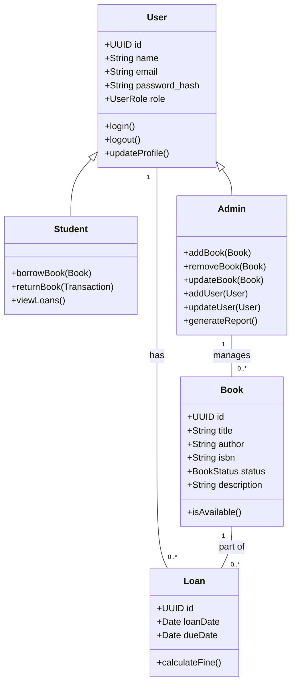

```mermaid
classDiagram
    class User {
        +UUID id
        +String name
        +String email
        +String password_hash
        +UserRole role
        +login()
        +logout()
        +updateProfile()
    }
    class Student {
        +borrowBook(Book)
        +returnBook(Transaction)
        +viewLoans()
    }
    class Admin {
        +addBook(Book)
        +removeBook(Book)
        +updateBook(Book)
        +addUser(User)
        +updateUser(User)
        +generateReport()
    }
    class Book {
        +UUID id
        +String title
        +String author
        +String isbn
        +BookStatus status
        +String description
        +isAvailable()
    }
    class Loan {
        +UUID id
        +Date loanDate
        +Date dueDate
        +calculateFine()
    }

    User <|-- Student
    User <|-- Admin

    User "1" -- "0..*" Loan : has
    Book "1" -- "0..*" Loan : part of
    Admin "1" -- "0..*" Book : manages
```
