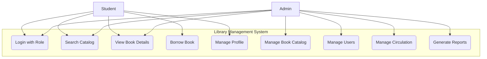

```mermaid
graph TD
    subgraph "Library Management System"
        UC1(Login with Role)
        UC2(Search Catalog)
        UC3(View Book Details)
        UC4(Borrow Book)
        UC5(Manage Profile)
        UC6(Manage Book Catalog)
        UC7(Manage Users)
        UC8(Manage Circulation)
        UC9(Generate Reports)
    end

    Student --> UC1
    Student --> UC2
    Student --> UC3
    Student --> UC4
    Student --> UC5

    Admin --> UC1
    Admin --> UC2
    Admin --> UC3
    Admin --> UC6
    Admin --> UC7
    Admin --> UC8
    Admin --> UC9
```
